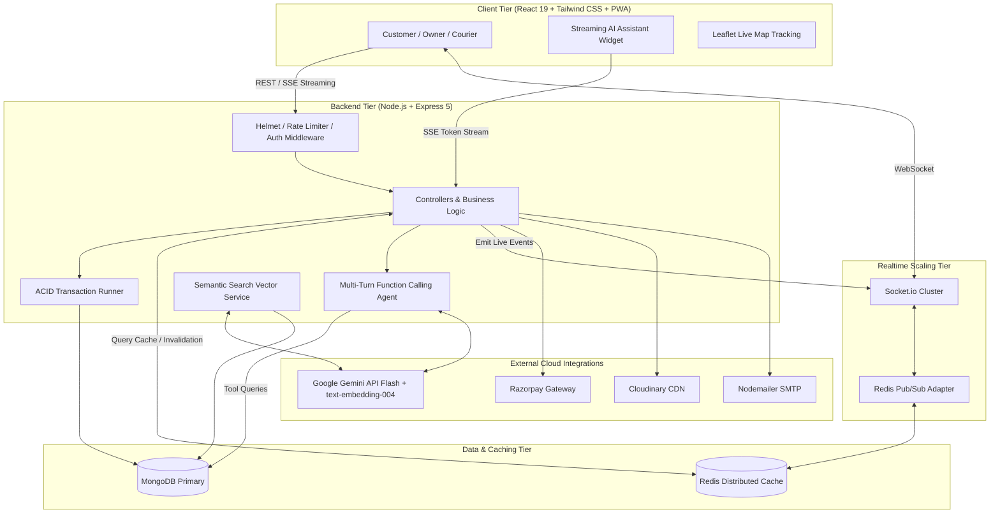
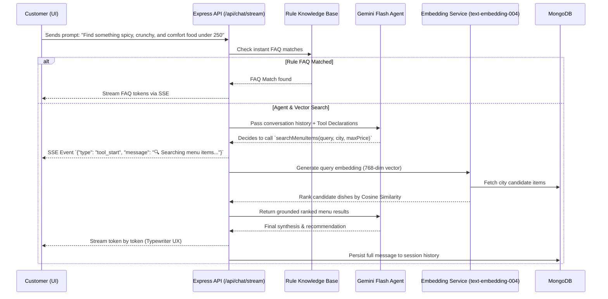

# Vingo - Food Delivery + Reel

[](https://nodejs.org/)
[](https://react.dev/)
[](https://vitejs.dev/)
[](https://www.mongodb.com/)
[](https://redis.io/)
[](https://socket.io/)
[](https://ai.google.dev/)
[](https://opensource.org/licenses/ISC)

> A high-performance, full-stack, role-aware food delivery platform featuring real-time order tracking, short-form food reels, Redis caching & horizontal socket scaling, MongoDB ACID transactions, and a Gemini-powered Vector RAG Assistant with token streaming.

---

## 🌟 Overview

Vingo is an enterprise-grade food delivery and social commerce platform architected for three distinct personas: **Customers**, **Restaurant Owners**, and **Delivery Partners**. It unifies restaurant discovery, dynamic cart & checkout with Razorpay, live GPS delivery routing, menu analytics, video reel engagement, and a live-grounded conversational AI assistant.

---

## 🚀 Key Technical Highlights

- **⚡ Distributed Caching & Scaling (Redis):** High-frequency queries (city shop catalogs, menu listings) cached with automatic invalidation on mutations, plus `@socket.io/redis-adapter` for multi-instance socket clustering.
- **🔒 MongoDB ACID Transactions:** Atomic multi-document mutations for order checkout and payment verification using `mongoose.startSession()`.
- **🧠 Vector Embeddings & Semantic Search (RAG):** Natural language dish search powered by Google Gemini `text-embedding-004` (768-dimensional vectors) and Cosine Similarity ranking (`"something spicy, crunchy, and comfort food under ₹250"`).
- **🌊 Real-Time Token Streaming (SSE):** Instant time-to-first-token typewriter UI for the in-app AI assistant with live tool execution status updates (`POST /api/chat/stream`).
- **📍 Real-Time GPS Tracking:** Live delivery partner coordinates broadcasted via Socket.io directly to interactive Leaflet map interfaces.
- **📱 Social Food Reels:** Video feeds with likes, threaded comments, bookmarking, and Cloudinary media optimization.
- **🛡️ Defensive Security:** Tiered rate-limiting, Helmet security headers, HTTP-only JWT cookies, server-verified Firebase Google Sign-In, and strict IDOR/auth-scoping.
- **📦 Progressive Web App (PWA):** Offline shell caching and home-screen installability.

---

## 📸 Application Screenshots & UI Preview

<p align="center">
  
</p>

### 📱 Multi-Role Interfaces & Operations

| 🏬 Restaurant Owner Dashboard | 🛵 Delivery Partner Hub |
| :---: | :---: |
|  |  |
| *Shop Management, Menu Items & Order Processing* | *Delivery Dispatch, Active Routes & Delivery Stats* |

---

## 🏗️ System Architecture



---

## 🔄 Agentic Vector RAG & Token Streaming Workflow



---

## 🛠️ Tech Stack

| Layer | Technologies |
|---|---|
| **Frontend** | React 19, Vite 7, React Router 7, Redux Toolkit, Tailwind CSS 4, Axios, Leaflet / React-Leaflet, Recharts, React Toastify, React Icons, PWA |
| **Backend** | Node.js, Express 5, Mongoose 8, Socket.io 4, `@socket.io/redis-adapter`, `ioredis`, Multer, CORS, Cookie-Parser, Helmet, express-rate-limit, Zod, Pino |
| **Caching & Realtime** | Redis (ioredis), Socket.io Redis Pub/Sub cluster adapter |
| **Database** | MongoDB (ACID Transactions via `mongoose.startSession()`, TTL Indexes) |
| **AI / GenAI** | Gemini Flash (Multi-turn tool calling), Gemini `text-embedding-004` (Vector search), Server-Sent Events (SSE) token streaming |
| **Auth** | JWT in HTTP-only cookies, Firebase Admin SDK (server-verified Google tokens) |
| **Payments** | Razorpay (tamper-proof verification & replay protection) |
| **Media Storage** | Cloudinary |
| **Testing & CI** | Vitest (48+ unit tests), Supertest, ESLint, GitHub Actions |

---

## 🧪 Testing & Verification

The test suite covers critical security, transactions, caching, vector similarity, and real-time streaming:

```bash
cd backend
npm test
```

```text
 ✓ tests/auth.validators.test.js (8 tests)
 ✓ tests/isAuth.test.js (4 tests)
 ✓ tests/order.verifyRazorpay.test.js (10 tests)
 ✓ tests/chat.ownership.test.js (6 tests)
 ✓ tests/chatTools.test.js (6 tests)
 ✓ tests/redis.test.js (4 tests)
 ✓ tests/transaction.test.js (2 tests)
 ✓ tests/semanticSearch.test.js (5 tests)
 ✓ tests/chatStream.test.js (2 tests)

 Test Files  9 passed (9)
      Tests  48 passed (48)
```

---

## ⚙️ Environment Variables

### Backend (`backend/.env`)

| Variable | Required | Purpose |
|---|:---:|---|
| `PORT` | No | Backend port (default `5000`) |
| `NODE_ENV` | No | `development` or `production` |
| `MONGO_URI` | **Yes** | MongoDB connection string |
| `JWT_SECRET` | **Yes** | JWT signing secret |
| `FRONTEND_URL` | No | Allowed frontend origin |
| `REDIS_URL` | No | Redis connection URI for caching and socket clustering (`redis://localhost:6379`) |
| `GEMINI_API_KEY` | **Yes** | Google Gemini API key for AI assistant and `text-embedding-004` |
| `CLOUDINARY_CLOUD_NAME` | **Yes** | Cloudinary cloud name |
| `CLOUDINARY_API_KEY` | **Yes** | Cloudinary API key |
| `CLOUDINARY_API_SECRET` | **Yes** | Cloudinary API secret |
| `EMAIL_USER` | **Yes** | SMTP sender email |
| `EMAIL_PASS` | **Yes** | SMTP app password |
| `RAZORPAY_KEY_ID` | **Yes** | Razorpay public key |
| `RAZORPAY_KEY_SECRET` | **Yes** | Razorpay secret key |
| `FIREBASE_SERVICE_ACCOUNT_KEY` | No | JSON service account key for Google Sign-In verification |

### Frontend (`frontend/.env`)

| Variable | Purpose |
|---|---|
| `VITE_SERVER_URL` | Base API server URL |
| `VITE_API_URL` | Streaming Chat API base URL |
| `VITE_GEOAPIKEY` | Geoapify map & address geocoding key |
| `VITE_RAZORPAY_KEY_ID` | Razorpay public checkout key |
| `VITE_FIREBASE_APIKEY` | Firebase Client API key |

---

## 🚀 Quickstart Guide

### 1. Backend Setup

```bash
cd backend
npm install
npm run dev
```

### 2. Frontend Setup

```bash
cd frontend
npm install
npm run dev
```

---

## 📡 Key API Endpoints

### AI Assistant & Semantic Search
- `POST /api/chat/stream` — **SSE Real-Time Streaming Assistant** with tool events and token-by-token generation.
- `POST /api/chat/message` — Standard JSON agent response fallback.
- `GET /api/item/search/semantic?query=&city=&maxPrice=&type=` — **Vector Semantic Search (RAG)** using 768-dim embeddings.

### Core Orders & Payments
- `POST /api/order/placeorder` — Atomic order placement (MongoDB ACID transaction).
- `POST /api/order/verify-razorpay` — Cryptographic signature & amount verification with double-spend guards.
- `POST /api/order/send-otp` / `POST /api/order/verify-otp` — Secure OTP delivery confirmation.

### Realtime & Shops
- `GET /api/shop/getshopsbycity/:city` — Redis-cached restaurant discovery.
- `GET /api/item/getitemsbycity/:city` — Redis-cached dish catalog.
- `POST /api/reel/upload` — Short-form video upload with Cloudinary processing.

---

## 📜 License

This project is licensed under the [ISC License](LICENSE).
